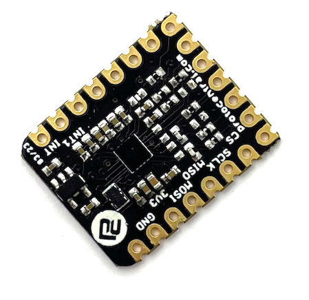

# ProtoCentral tinyECG MAX30001G ECG & Respiration monitoring module

ProtoCentral tinyECG MAX30001G ECG & Respiration monitoring module is a tiny module based on the Analog Devices MAX30001 ECG and Respiration sensor. It is a single lead ECG and Respiration sensor with a built-in amplifier, front-end and ADC. It can be used to measure ECG and Respiration signals from the human body. 

The form factor of the module is designed to fit the [Adafruit QT Py](https://www.adafruit.com/category/595) or[Seeed Studio XIAO](https://wiki.seeedstudio.com/Seeeduino-XIAO/) series of microcontroller boards. These boards offers a tiny form factor with a built-in USB port and a battery connector and are based on your choice of a multitude of microcontrollers . Coupled with one of these boards, you can build a tiny wearable ECG and Respiration monitoring device.

## Features and Specifications
* Analog Devices [MAX30001G ECG and Respiration sensor](https://www.analog.com/en/products/max30001.html)
* Footprint compatible for add-on board to [Adafruit QT Py](https://www.adafruit.com/category/595) or[Seeed Studio XIAO](https://wiki.seeedstudio.com/Seeeduino-XIAO/)
* BioZ drive current range from 55nA to 96 uA
* Ultra-low nosie with 15.9 ENOB for ECG and 17 bits ENOB for Bioimpedance/Respiration
* High input impedance for use with dry electrodes
* Onboard 3.3V LDO for power regulation
* Board comes with castellated pads for easy soldering into your project
* Breadboard compatible 2.54mm pitch headers for easy connection

## Repository Contents

* /hardware - Hardware design files

## License Information

This product is open source! Please see the LICENSE.md file for more information.

## Getting Started
_Getting Started Guide coming soon..._

## License Information

This product is open source! Both, our hardware and software are open source and licensed under the following licenses:

Hardware
---------

**All hardware is released under the [CERN-OHL-P v2](https://ohwr.org/cern_ohl_p_v2.txt)** license.

Copyright CERN 2020.

This source describes Open Hardware and is licensed under the CERN-OHL-P v2.

You may redistribute and modify this documentation and make products
using it under the terms of the CERN-OHL-P v2 (https:/cern.ch/cern-ohl).
This documentation is distributed WITHOUT ANY EXPRESS OR IMPLIED
WARRANTY, INCLUDING OF MERCHANTABILITY, SATISFACTORY QUALITY
AND FITNESS FOR A PARTICULAR PURPOSE. Please see the CERN-OHL-P v2
for applicable conditions

Software
--------

**All software is released under the MIT License(http://opensource.org/licenses/MIT).**

THE SOFTWARE IS PROVIDED "AS IS", WITHOUT WARRANTY OF ANY KIND, EXPRESS OR IMPLIED, INCLUDING BUT NOT LIMITED TO THE WARRANTIES OF MERCHANTABILITY, FITNESS FOR A PARTICULAR PURPOSE AND NONINFRINGEMENT. IN NO EVENT SHALL THE AUTHORS OR COPYRIGHT HOLDERS BE LIABLE FOR ANY CLAIM, DAMAGES OR OTHER LIABILITY, WHETHER IN AN ACTION OF CONTRACT, TORT OR OTHERWISE, ARISING FROM, OUT OF OR IN CONNECTION WITH THE SOFTWARE OR THE USE OR OTHER DEALINGS IN THE SOFTWARE.

Documentation
-------------
**All documentation is released under [Creative Commons Share-alike 4.0 International](http://creativecommons.org/licenses/by-sa/4.0/).**

You are free to:

* Share — copy and redistribute the material in any medium or format
* Adapt — remix, transform, and build upon the material for any purpose, even commercially.
The licensor cannot revoke these freedoms as long as you follow the license terms.

Under the following terms:

* Attribution — You must give appropriate credit, provide a link to the license, and indicate if changes were made. You may do so in any reasonable manner, but not in any way that suggests the licensor endorses you or your use.
* ShareAlike — If you remix, transform, or build upon the material, you must distribute your contributions under the same license as the original.

Please check [*LICENSE.md*](LICENSE.md) for detailed license descriptions.